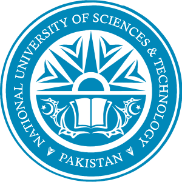

I'm a 4th-year Ph.D. student in CS at the [Network Architecture Lab (NAL)](https://www.epfl.ch/labs/nal/), [EPFL](https://www.epfl.ch/en/), supervised by [Prof. Katerina Argyraki](https://people.epfl.ch/katerina.argyraki). Prior to this, I completed my MS in CS at [LUMS](https://lums.edu.pk/), where I was part of [Network and Systems Group (NSG@LUMS)](https://nsg.lums.edu.pk/), working under the guidance of [Prof. Ihsan Qazi](https://www.ihsanqazi.com/) and [Prof. Zafar Qazi](https://web.lums.edu.pk/~zafar/). 

My research interests span Network/Web Measurement, Network Inference, Content Delivery Networks (CDN), Adaptive Video Streaming, Performance Metrics, Statistical Inference, and Applied Machine Learning. In essence, I work at the intersection of Computer Networks and Applied Data Science, with the goal of making the Internet more fair, transparent, and inclusive for everyone. Currently, my research focuses on redefining network neutrality for the modern Internet by empirically analyzing the performance of services deployed on public clouds such as adaptive video streaming and social media platforms. Please feel free to drop me an email if you have aligned interests. 
 

## Education

  
  
    <strong>EPFL (École polytechnique fédérale de Lausanne)</strong>, Switzerland 
    Ph.D. in Computer Science (2021-Present)  
    Advised by Dr. Katerina Argyraki
  

 

  
  
    <strong>LUMS (Lahore University of Management Sciences)</strong>, Pakistan 
    M.Sc in Computer Science (2019-21)  
    CGPA: 3.93/4.00 (Rank: 1/75 - President's Gold Medal) 
    <i>Thesis: "Causal Inference on the Impact of Android Go on Mobile Web Performance"</i>
  

 

  
  
    <strong>NUST (National University of Sciences & Technology)[Link]</strong>, Pakistan 
    B.Eng in Electrical Engineering (2014-18)  
    CGPA: 3.70/4.00 (Rank: Top 5%) 
  

 

## Work Experience

  
  
    <strong>M-Lab (led by Google)</strong> (Jan 2022 - May 2022)  
    Research Fellow 
  

 

  
  
    <strong>KAIST</strong>, South Korea (Sep 2018 - Jan 2019)  
    Research Assistant 
    (Computer Systems Lab) 
  

 

  
  
    <strong>XGrid</strong>, Pakistan (May 2019 - Aug 2019)  
    Software Engineer 
    (AWS Cloud Deployment Team)
  

 

  
  
    <strong>CERN</strong>, Switzerland (Jul 2017 - Sep 2017)  
    Software Engineer Intern at Openlab 
    (Communications & Networking Team) 
  

 

## Publications
* [Caching and Neutrality](https://dl.acm.org/doi/abs/10.1145/3626111.3628211).  
**Muhammad Abdullah**, Pavlos Nikolopoulos, Katerina Argyraki\
<strong style="color: red;">ACM Hot Topics in Networks (HotNets) 2023</strong>

* [Localizing Traffic Differentiation](https://dl.acm.org/doi/abs/10.1145/3618257.3624809).  
Zeinab Shmeis, **Muhammad Abdullah**, Pavlos Nikolopoulos, Katerina Argyraki, David Choffnes , Phillipa Gill\
<strong style="color: red;">ACM Internet Measurement Conference (IMC) 2023</strong>

* [Causal Impact of Android Go on Mobile Web Performance](https://dl.acm.org/doi/abs/10.1145/3517745.3561456).  
**Muhammad Abdullah**, Zafar Qazi, Ihsan Qazi\
<strong style="color: red;">ACM Internet Measurement Conference (IMC) 2022</strong>

* [Rethinking Web for Affordability and Inclusion](https://dl.acm.org/doi/abs/10.1145/3484266.3487376).  
Ihsan Qazi, Zafar Qazi, Ayesha Ali, **Muhammad Abdullah**, Rumaisa Habib\
<strong style="color: red;">ACM Hot Topics in Networks (HotNets) 2021</strong>

* [Using Application Layer Banner Data to Automatically Identify IoT Devices](https://dl.acm.org/doi/abs/10.1145/3411740.3411744).  
Talha Javed , Muhammad Haseeb , **Muhammad Abdullah** , Mobin Javed\
<strong style="color: red;">ACM SIGCOMM Computer Communication Review (CCR) 2020</strong>
 

## Teaching
* Head TA — [CS202: Computer Systems](https://edu.epfl.ch/coursebook/fr/computer-systems-CS-202)
Fall 2023, EPFL.
* Head TA — [CS332: Introduction to Database Systems](https://edu.epfl.ch/coursebook/en/introduction-to-database-systems-CS-322)
Spring 2023, EPFL.
* Head TA — [COM208: Computer Networks](https://edu.epfl.ch/coursebook/en/computer-networks-COM-208)
Fall 2022, EPFL.
* Head TA — [CS334: Principles and Techniques of Data Science](https://libguides.lums.edu.pk/ptds)
Spring 2021, LUMS.
 

## Talks
* [Presented our paper "Causal impact of Android go on mobile web performance"](https://dl.acm.org/doi/abs/10.1145/3517745.3561456)\
Internet Measurement Conference (IMC) at Nice, France  (Oct 2022)
* [A Primer on Zeek IDS](https://www.nccs.pk/Information/Workshops)\
National Centre for Cyber Security at Lahore, Pakistan (Oct 2020)
* [Network Automation with Brocade Workflow Composer](https://cds.cern.ch/record/2280120)\
Lightning Talks at CERN, Switzerland (Jul 2017)
 

## Awards & Honors
* Received [Research Fellowship](https://www.measurementlab.net/blog/research-fellow-announcement/) from [M-Lab](https://www.measurementlab.net/) (led by Google) for our work on localizing network neutrality violations (Dec 2021)
* Gold Medal Awarded by the President of Pakistan for securing 1st position in Master's program (Jun 2021)
* EDIC Computer Science Fellowship, EPFL (Jan 2021)
* Dean's High Achievers Award, NUST (Jan 2018)
* One of the 40 students selected globally for KAIST Electrical Engineering Camp (Jan 2018)
* One of the 37 students selected globally for CERN Openlab Internship Program (Jan 2017)

